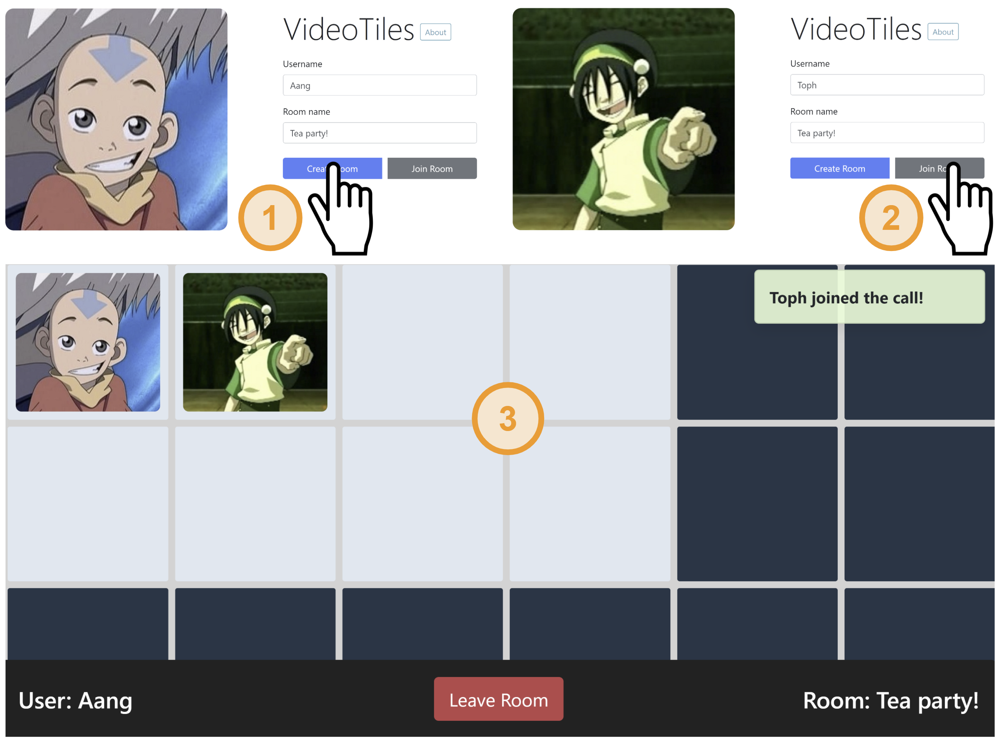
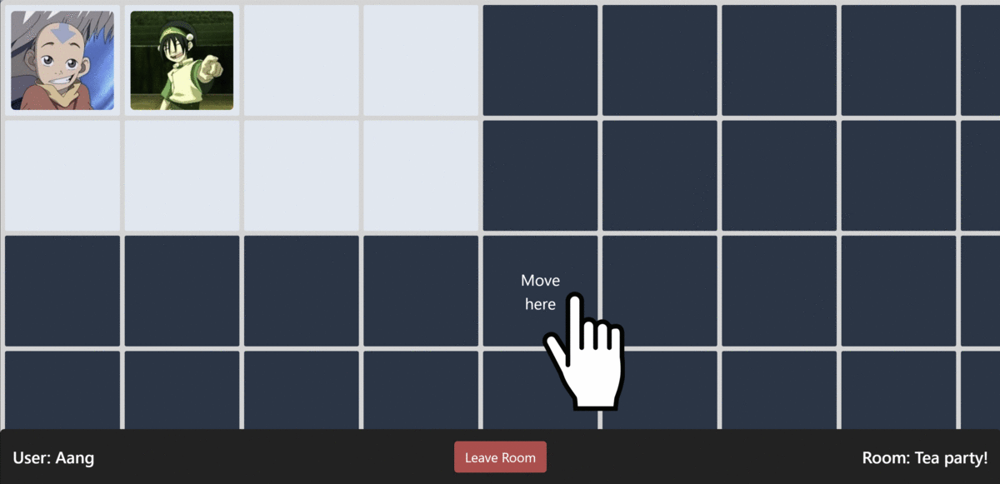
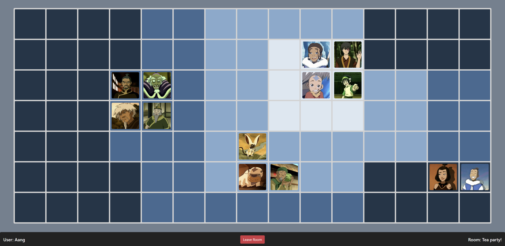

# VideoTiles

Try it out at https://video-tiles.web.app :upside_down_face: !

> :warning: Only works on Google Chrome (not Firefox, Safari, or Edge)

> :warning: Only meant for desktop (not phones or tablets)

> :warning: Can't typically handle ~10 or more people (might even start failing
at 6 or 7 people)

## Table of Contents

* [The Idea](#the-idea)
* [How to Use](#how-to-use)
  * [Create / Join a Room](#create--join-a-room)
  * [Click to Move](#click-to-move)
  * [Proximity-Based Volume](#proximity-based-volume)
  * [Grid Layout & Private Rooms](#grid-layout--private-rooms)
  * [Arrow Keys to Move](#arrow-keys-to-move)
* [Implementation](#implementation)

## The Idea

Have you ever been stuck in an awkward group video call? Like a Zoom birthday
party with a bunch of people you'd never met before? Or a huge Zoom family
reunion where you had to take turns talking one by one?

I found it hard to connect with my friends and family over group calls because
my go-to video chat apps (e.g. Zoom, Facebook Messenger, Google Meets) didn't
support the social group dynamics that I was used to in the physical world. For
example, I wished we could:

* Have **multiple conversations** going at the same time
* Naturally **move and form clusters** around those conversations
* Hear the conversations closest to you most clearly
* Overhear the joy and laughter of a nearby conversation

I couldn't find an existing video chat app that accomplished 
this[<b>(1)</b>](#footnote), so I decided to take a stab at it myself.
I now present to you [VideoTiles](https://video-tiles.web.app), my very, *very*
rudimentary proof of concept video chat app.

## How to Use

### Create / Join a Room

The interface is fairly simple. All you need to do is:

0. Enable your camera and microphone
1. Create a room (with whatever username or room name you want)
2. Have 1 or more friends join your room (using the same room name that you used)
3. Start chatting!

### Click to Move

You can simply use your mouse to click any tile in the grid to move to it.

### Proximity-Based Volume

The color of a person's tile represents the volume at which you'll hear them.
For example, if a person's tile is...

* The lightest blue (closest to you), you'll hear them at full volume
* Medium blue (nearby to you), you'll hear them at half volume
* Dark blue (far from you), you'll hear them at very low volume
* The darkest blue (farthest from you), you won't be able to hear them at all

### Grid Layout & Private Rooms

The entire grid is 7x15 (7 rows tall and 15 columns wide). The grid is not
meant to fit within a laptop (or even monitor) screen. But you can always
**zoom out** if you want to get a bird's eye view of the entire space.

Each of the grid's four corners has a 2x4 **"private room"**. Private rooms 
have **all-or-nothing** audio. That is, only people within a given private
room will be able to hear each other. Anybody outside the private room will
not be able to hear anything inside. 

The layout of the grid allows natural conversation clusters to form. For
example, you could have a few groups of people chatting at varying volume
levels. 

### Arrow Keys to Move

In addition to being able to click to move, you may also use the arrow keys
on your keyboard to move around. 

## Implementation

TODO(1): Mention WebRTC

* Link to some of the resources (YouTube talk, API docs)
* Credit WebRTC samples code, WebRTCHacks, etc
* How I decided not to bother with an SFU media server even though it
would improve performance (and potentially support larger group calls)

TODO(1): Mention Firebase

* Link to the FirebaseRTC codelab

TODO(1): Mention Bootstrap

## Footnotes

<b>(1)</b><sp>I later learned of this <i>incredible</i> video chat app 
called <b>Gather</b> (https://gather.town/). It's completely FREE and supports
all the features I wanted and more! I highly recommend that you try it out with
friends and family!

